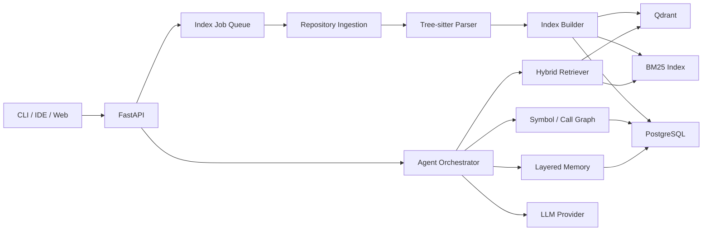

# CodeMind

[](https://github.com/danxiaogu520/CodeMind/actions/workflows/ci.yml)
[](https://github.com/danxiaogu520/CodeMind/actions/workflows/security.yml)
[](LICENSE)

面向多语言代码库理解的 RAG Agent 智能开发助手。

CodeMind 将 Git 仓库转换成可检索、可追踪、可持续更新的代码知识库，并通过混合检索、调用关系分析和显式 Agent Workflow 回答项目级问题。

## 60 秒启动

只需要 Docker Compose：

```bash
docker compose up -d --build --wait
docker compose --profile demo run --rm demo
```

第二条命令会自动完成“导入示例仓库 → 等待索引 → 执行调用关系分析 → 输出文件/行号引用 → 展示四层 Memory”。浏览器 Demo 位于 `http://127.0.0.1:8000/demo`，OpenAPI 位于 `http://127.0.0.1:8000/docs`。

使用本机 NVIDIA GPU 和零 API 费用的真实模型：

```bash
sudo docker compose \
  -f compose.yaml \
  -f deploy/compose.local-models.yaml \
  up -d --build --wait
```

首次启动会下载约 639 MB 的 `qwen3-embedding:0.6b` 和约 5.2 GB 的 `qwen3:8b`。该覆盖启用 1024 维真实 Embedding、本地 grounded LLM 和独立 Qdrant collection；Reranker 暂时使用低延迟规则实现。详见[本地模型部署](docs/deployment.md#7-零-api-费用的本地模型)。

停止服务但保留数据：

```bash
docker compose down
```

## 项目定位

CodeMind 不是“把代码切块后交给大模型”的演示项目。它关注代码场景中四个真正困难的问题：

1. 以符号和语法结构为边界建立代码知识单元；
2. 同时利用语义、关键词和结构关系找全相关代码；
3. 让 Agent 以可观察、可恢复的流程完成多步分析；
4. 用分层记忆控制大型仓库的上下文规模和陈旧信息。

## 目标能力

- 导入本地目录或公开 Git 仓库；
- 解析 Python、Rust、JavaScript/TypeScript；
- 生成文件、类、函数、方法等结构化 Chunk；
- 建立向量索引和 BM25 索引；
- 执行 Hybrid Retrieval 与可插拔 Rerank；
- 回答“模块做什么”“功能在哪里”“符号如何被调用”等问题；
- 通过 FastAPI 暴露异步索引任务、问答和项目查询接口；
- 使用 Docker Compose 启动 API、Worker、PostgreSQL 和 Qdrant。

## 系统概览



## 文档导航

- [产品与范围](docs/product.md)
- [总体架构](docs/architecture.md)
- [代码摄取与索引](docs/indexing.md)
- [混合检索设计](docs/retrieval.md)
- [Agent 与 Memory](docs/agent-memory.md)
- [API 契约](docs/api.md)
- [部署与运维](docs/deployment.md)
- [本地开发指南](docs/development.md)
- [测试与评测](docs/evaluation.md)
- [性能与发布验收](docs/performance-report.md)
- [项目审查与改进建议](docs/project-review.md)
- [3 分钟演示脚本](docs/demo-script.md)
- [故障排查](docs/troubleshooting.md)
- [实施路线图](docs/roadmap.md)
- [工程 Backlog](docs/backlog.md)
- [架构决策记录](docs/adr/README.md)

## 目录结构

```text
codemind/
├── apps/api/                 # FastAPI 入口与 HTTP DTO
├── src/codemind/
│   ├── application/          # 用例编排：导入、检索、分析
│   ├── domain/               # 实体、值对象、端口接口
│   ├── ingestion/            # Git、文件发现、增量同步
│   ├── parsing/              # Tree-sitter、符号与关系提取
│   ├── indexing/             # Embedding、BM25、向量写入
│   ├── retrieval/            # Query 理解、融合、Rerank
│   ├── agent/                # Grounded answer 与引用校验
│   ├── evaluation/           # Retrieval / Agent benchmark
│   └── infrastructure/       # DB、索引、Memory、LangGraph 适配器
├── tests/                    # unit / integration / e2e / eval
├── docs/                     # 设计与使用文档
└── deploy/                   # Docker 与部署配置
```

## 当前状态

Phase 5 作品化发布已经完成。项目具备多语言知识库、Hybrid Retrieval、LangGraph Agent Workflow、五层 Memory、文件级增量索引、Demo CLI、浏览器 UI、可恢复 SSE、完整 Compose 和发布评测。回答只允许引用当前 Run 的 Evidence，并可追踪到索引版本、文件和行号。

默认模式仍使用可离线复现的 feature-hash、启发式排序与 grounded template 基线。可选本地模型覆盖已接入 `qwen3-embedding:0.6b` 与 `qwen3:8b`，通过 Ollama 在本机运行且不产生 API 费用；Provider 接口保持隔离。详细任务和验收标准见[路线图](docs/roadmap.md)。

## 本地开发

不要激活或修改全局 Python 环境。uv 会读取 `.python-version`，安装 Python 3.12，并在项目内创建 `.venv`：

```bash
uv python install 3.12
uv sync --locked --all-groups
uv run codemind-api
```

服务启动后：

- Liveness：`http://127.0.0.1:8000/health/live`
- Readiness：`http://127.0.0.1:8000/health/ready`
- OpenAPI：`http://127.0.0.1:8000/docs`

如果 PostgreSQL/Qdrant 未启动，liveness 返回 200、readiness 返回 503，这是预期行为。

执行全部质量门禁：

```bash
uv run ruff format --check .
uv run ruff check .
uv run pyright
uv run lint-imports
uv run pytest
```

完整容器环境可使用：

```bash
docker compose up --build --wait
```

导入 Compose 中挂载的示例仓库：

```bash
curl -X POST http://127.0.0.1:8000/api/v1/repositories \
  -H 'Content-Type: application/json' \
  -d '{"name":"sample","source":{"type":"local","path":"/fixtures/sample_python"},"ref":"main"}'
```

响应中的 `job_id` 可通过 `GET /api/v1/index-jobs/{job_id}` 轮询；任务完成后，`GET /api/v1/repositories/{repository_id}` 会返回活动索引版本。

索引完成后执行 Hybrid Search：

```bash
curl -X POST http://127.0.0.1:8000/api/v1/repositories/<repository_id>/search \
  -H 'Content-Type: application/json' \
  -d '{"query":"Where is create_token implemented?","limit":5}'
```

创建异步 Agent Run：

```bash
curl -X POST http://127.0.0.1:8000/api/v1/repositories/<repository_id>/runs \
  -H 'Content-Type: application/json' \
  -d '{"question":"Trace calls to create_token","workflow":"trace_symbol"}'
```

通过 `GET /api/v1/runs/{run_id}` 查询最终答案，或连接 `GET /api/v1/runs/{run_id}/events` 消费可恢复的 SSE 事件。

检查当前版本的项目与会话记忆：

```bash
curl "http://127.0.0.1:8000/api/v1/repositories/<repository_id>/memories?query=authentication&session_id=demo"
```

更多说明见[开发指南](docs/development.md)。

Phase 4 的增量算法、Memory 失效矩阵与可复现实测见 [Phase 4 验收报告](docs/phase4-report.md)。
