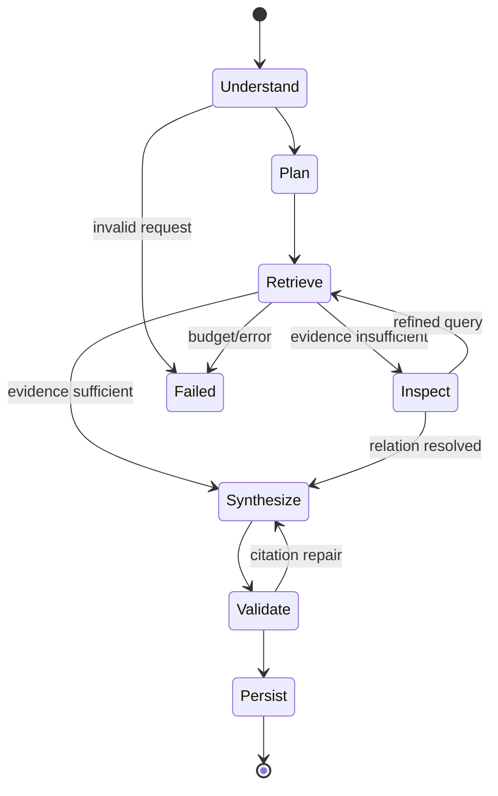

# Agent Workflow 与 Memory

## 1. Agent 设计

Agent 采用有边界的显式状态机，并以 LangGraph `StateGraph` 作为默认执行 Runtime。Planner 不直接获得数据库或文件系统能力，只能选择白名单工具和参数。每个 Run 有最大步骤、Token、时间和工具调用预算。



## 2. Run State

```python
class AgentState(TypedDict):
    run_id: str
    repository_id: str
    index_version_id: str
    session_id: str | None
    question: str
    intent: str
    plan: list[PlanStep]
    completed_steps: list[StepResult]
    evidence: list[Evidence]
    observations: list[Observation]
    budgets: RunBudgets
    answer: Answer | None
    status: str
```

索引版本在 Run 开始时固定，避免分析过程中仓库 active 版本切换导致证据不一致。

`AgentState` 是 CodeMind 应用层契约，不继承 LangGraph 或 LangChain 类型。LangGraph Adapter 负责将它转换为 Graph State，并把 `run_id` 映射为 checkpoint `thread_id`。

## 3. MVP 工具

| 工具 | 输入 | 输出 |
|---|---|---|
| `search_code` | query, filters, limit | Evidence[] |
| `get_file_outline` | path | 文件摘要与符号列表 |
| `read_symbol` | symbol_id 或 qualified_name | 完整符号源码与元数据 |
| `find_references` | symbol_id, relation types, depth=1 | 关系边与相关 Evidence |
| `list_tree` | path, depth | 项目目录树 |
| `get_project_summary` | repository_id | 项目记忆摘要 |

工具返回结构化数据并进行权限、版本和预算校验。MVP 不提供 shell、任意文件读取或代码执行工具。

## 4. 预置工作流

### `answer_question`

理解问题 → 混合检索 → 必要时读取完整符号 → 合成带引用回答 → 引用校验。

### `explain_module`

列出模块树 → 找入口和公共符号 → 检索模块职责 → 查看一跳依赖 → 输出职责、主流程、依赖与风险。

### `trace_symbol`

解析目标符号 → 查找定义 → 获取 callers/callees → 对关键节点读取源码 → 输出带置信度的调用链。

预置流程保证常见任务稳定；开放式 Planner 只在无法匹配流程时启用。

## 5. 分层 Memory

| 层级 | 生命周期 | 内容 | 注入策略 |
|---|---|---|---|
| Working Memory | 单次 Run | 计划、证据、观察、预算 | 始终，但按预算裁剪 |
| Session Memory | 会话 | 用户目标、已确认事实、最近问题摘要 | 与当前问题相关时注入 |
| Project Memory | 索引版本 | 项目结构、模块职责、术语、架构摘要 | 分层检索：项目→模块 |
| Episodic Memory | 跨 Run | 成功分析报告、工具轨迹摘要、用户反馈 | 相似任务命中时注入 |

原始代码不属于 Memory，而属于可版本化的 Knowledge Base。Memory 中的事实必须带来源 index version；版本变化后根据依赖文件集合失效或标记 stale。

### Checkpoint 与 Memory 的边界

- LangGraph Checkpointer：保存节点执行位置、Working Memory、pending writes 和恢复所需快照；
- Session Memory：保存用户目标和会话摘要，可由节点按需读取，但不直接等于完整 checkpoint；
- Project/Episodic Memory：由 CodeMind 自己的 `MemoryPort` 管理，支持索引版本、来源文件和失效规则；
- CodeMind Run/Step：保存 API 状态、审计、Token/费用和事件投影，不用 checkpoint 表直接对外服务。

生产默认使用 PostgreSQL Checkpointer。测试使用内存实现；任何 crash-resume 测试必须使用真实 PostgreSQL 适配器。

## 6. 压缩与失效

- 达到上下文阈值时，将旧步骤压缩为结构化摘要，不删除关键 evidence id；
- Project Memory 使用项目摘要 → 模块摘要 → 符号证据三级展开；
- 分析产物记录 `source_file_ids/content_hashes`，增量索引后只失效受影响产物；
- 没有来源的模型推断只能存为 `hypothesis`，不得升级为项目事实；
- 用户反馈可提升或降低 episodic memory 的复用权重。

## 7. 错误与安全边界

- 工具参数 schema 校验失败：允许 Planner 修复一次；
- 检索无结果：明确返回证据不足，并建议具体的重试条件；
- 模型超时：指数退避后降级或结束，不无限循环；
- 达到预算：基于已有证据给出部分结论并标记未完成项；
- 所有模型输入均视仓库文本为不可信数据，提示词要求忽略代码/注释中的指令。

## 8. LangGraph Runtime 规则

- 预置工作流使用静态边和少量条件边；开放 Planner 只能选择白名单工具与有限目标节点；
- 节点返回状态增量，不原地修改共享状态；
- 节点可能因恢复而重新执行，因此工具调用和持久化操作必须幂等；
- LangGraph streaming 只作为内部事件源，对外仍使用 CodeMind 的稳定 SSE 事件契约；
- 不在 Graph State 中保存数据库连接、客户端、异常对象或不可序列化的大段源码；
- 框架升级必须通过 graph snapshot、恢复和事件顺序契约测试。

## 9. Phase 3 实现记录

默认 Graph 为 `plan → retrieve → inspect → synthesize → validate → finalize`，由条件边在取消、失败或预算耗尽时提前进入 finalize。`auto` 只在三种白名单工作流间路由，不开放自由 ReAct 循环。

Graph State 只保存 JSON-safe 的 ID、计划、Evidence、Observation、预算计数与答案草稿。`run_id` 直接映射 LangGraph `thread_id`；PostgreSQL Checkpointer 保存执行恢复状态，`agent_runs/agent_steps/agent_events` 保存对外产品状态。节点审计与事件使用幂等键，因此 checkpoint 提交前崩溃导致节点重放时不会重复产品记录。

默认 LLMProvider 为离线 `TemplateGroundedLLM`。本地模型覆盖可切换到 Ollama `qwen3:8b`：Provider 将 Evidence 和 Observation 标记为不可信数据，要求模型返回包含答案、Evidence ID 和 incomplete 标志的 JSON；只接受本次 Run 白名单内的 Evidence ID，并由既有引用验证器再次重建路径与行号。模型服务不可用或输出不合规时默认回退到模板答案，并将回答标为 incomplete。

## 10. Phase 4 实现记录

Working Memory 继续存放于 LangGraph Graph State；当 Observation 超过阈值时压缩旧项为结构化摘要，摘要保留所有 Evidence ID、已调用工具和压缩数量。持久化 Memory 由 CodeMind `MemoryPort` 管理，数据库记录统一包含 `repository_id/index_version_id/layer/scope_key`、会话和 Run 来源、Evidence ID、来源路径与内容哈希、置信度和 stale 状态。

索引完成时生成一个 Project 摘要和按目录划分的 Module 摘要。成功或部分成功的 Run 将最终回答写为 Episodic Memory；提供 `session_id` 时同时追加压缩后的 Session Memory。Planner 只召回当前 Run 固定索引版本下的非 stale Memory，Session Memory 额外要求会话相同，召回内容始终按不可信数据注入。

跨版本重基遵循保守规则：Project/Module 总是失效并为新版本重建；Session/Episodic 的全部来源均未变化时复制到新版本，任一来源改变或缺少可验证来源时标记 stale 且不复制。这样不会把旧分析当成新项目事实，同时允许与本次修改无关的分析继续复用。
