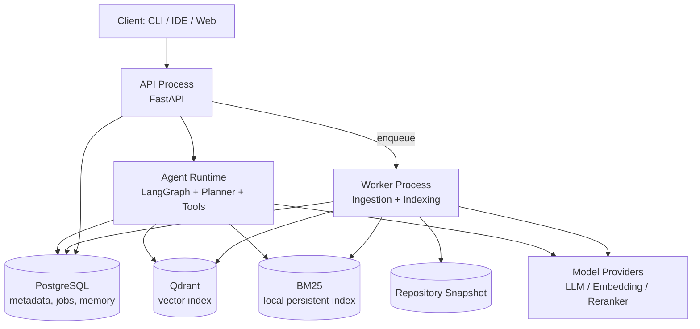
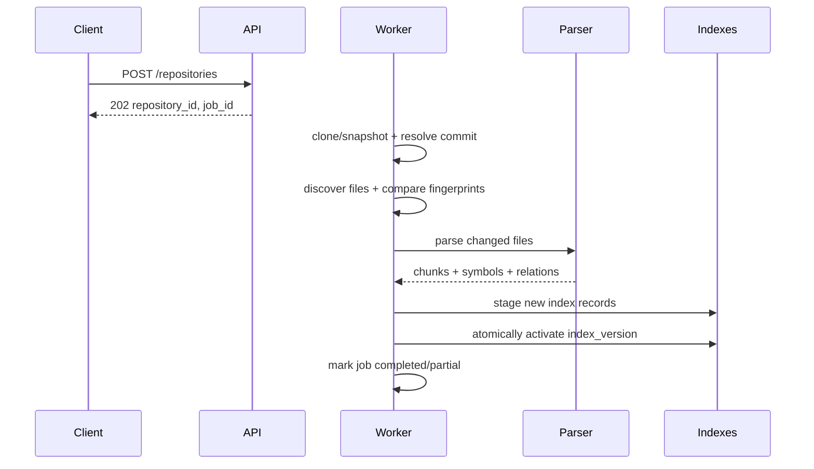
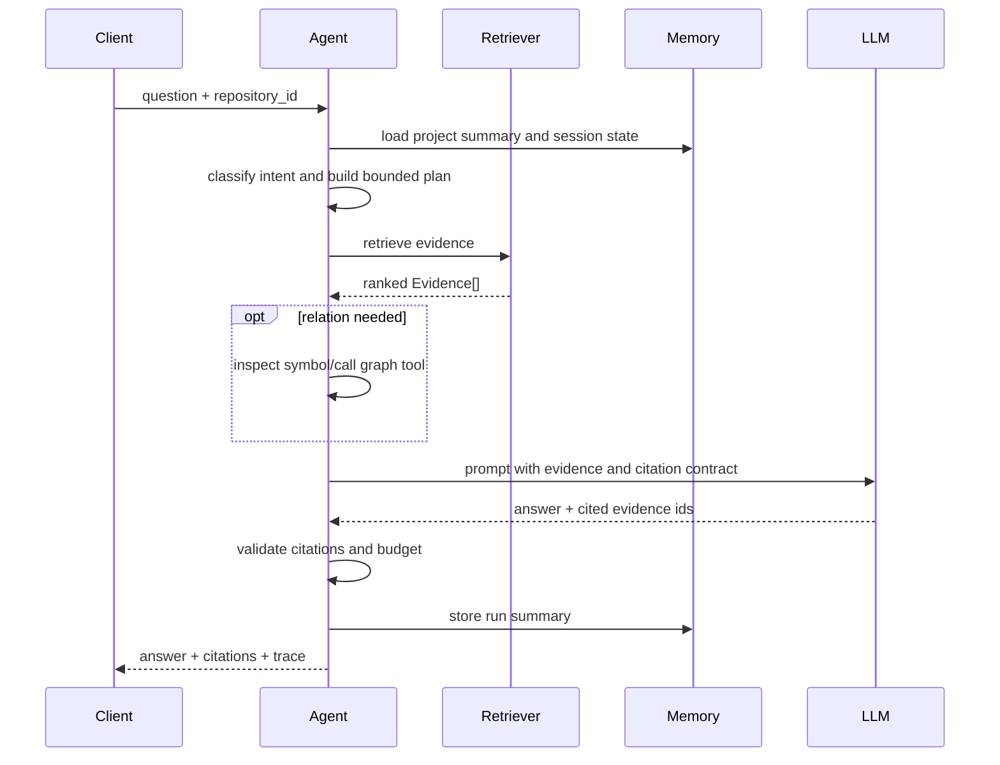
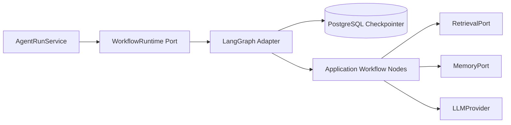

# 总体架构

## 1. 架构原则

1. **解析结果是事实源**：代码正文、符号和静态关系均绑定 commit，不让模型生成内容覆盖事实。
2. **检索与生成解耦**：检索返回标准 `Evidence`，生成层只消费证据。
3. **工作流显式化**：Agent 的步骤、预算、错误和产物落库，避免不可调试的自由循环。
4. **先模块化单体，后拆服务**：MVP 共用一个代码库和领域模型，API 与 Worker 分进程部署。
5. **默认安全**：只读仓库，不执行目标项目，不将密钥写入索引。

## 2. 容器视图



MVP 可使用数据库任务表加 `SELECT ... FOR UPDATE SKIP LOCKED` 充当队列，避免过早引入 Redis/Celery。任务量明显增加后，再将 `JobQueue` 端口换成 Redis Streams、Arq 或其他实现。

## 3. 领域边界

| 模块 | 职责 | 不负责 |
|---|---|---|
| `ingestion` | 获取快照、文件发现、ignore、安全过滤、增量 diff | 语法解析 |
| `parsing` | AST、符号、import、调用边提取与结构化 Chunk | 持久化和模型调用 |
| `indexing` | 内容指纹、Embedding 批处理、稀疏/向量索引一致性 | 问题理解 |
| `retrieval` | Query 分类、并行召回、过滤、融合、Rerank | 最终自然语言回答 |
| `agent` | 计划、工具选择、预算、状态迁移、答案合成 | 存储细节 |
| `memory` | 分层上下文的写入、压缩、检索和失效 | 原始代码事实 |
| `infrastructure` | 数据库、模型、Git、配置等适配器 | 业务策略 |

## 4. 关键端口

核心逻辑依赖抽象接口，基础设施实现放在外围：

```python
class CodeParser(Protocol):
    def parse(self, source: SourceFile) -> ParsedFile: ...

class EmbeddingProvider(Protocol):
    async def embed(self, texts: list[str]) -> list[list[float]]: ...

class VectorIndex(Protocol):
    async def replace_version(self, repository_id: str, version_id: str,
                              chunks: Sequence[EmbeddedChunk]) -> None: ...
    async def search(self, repository_id: str, version_id: str,
                     vector: Sequence[float], limit: int) -> list[SearchHit]: ...

class LexicalIndex(Protocol):
    async def search(self, query: str, filters: SearchFilter, k: int) -> list[Hit]: ...

class AgentTool(Protocol):
    name: str
    async def invoke(self, arguments: dict, context: RunContext) -> ToolResult: ...

class WorkflowRuntime(Protocol):
    async def execute(self, run: AgentRunRecord) -> None: ...
```

`WorkflowRuntime` 的默认基础设施实现使用 LangGraph `StateGraph`。应用层只依赖上述端口，因此 Agent 状态、Tool 和用例不暴露 `langgraph`、`langchain` 或 `langchain_core` 类型。

## 5. 核心数据流

### 仓库导入



### 代码问答



## 6. 一致性策略

- 每次成功索引产生不可变 `index_version`；查询默认只读 `active_index_version`。
- 新版本先写元数据和索引，全部关键步骤成功后再切换 active 指针。
- Chunk ID 由 `repository_id + path + symbol_path + content_hash` 稳定生成。
- 删除文件通过版本差异标记 tombstone；旧版本按保留策略异步回收。
- Reranker 或 LLM 失败时允许降级；解析或索引关键阶段失败时不得激活半成品版本。

## 7. 技术选型

| 能力 | MVP 选择 | 说明 |
|---|---|---|
| API | FastAPI + Pydantic v2 | 类型清晰、异步友好、自动 OpenAPI |
| 领域/Worker | Python 3.12 | AI 生态完整，交付速度高 |
| 解析 | tree-sitter / tree-sitter-language-pack | 统一多语言入口 |
| 元数据 | PostgreSQL；测试/单机可 SQLite | 事务、JSONB、任务协调 |
| 向量库 | Qdrant | 过滤、版本管理、Docker 体验较好 |
| BM25 | SQLite 文件索引 + 原子替换 | 面向代码 token 定制；共享卷单写多读 |
| Agent | 显式状态机 + LangGraph 默认 Runtime | 复用 checkpoint、恢复和 streaming，同时以端口隔离框架 |
| 可观察性 | structlog + Trace Middleware + Run Event | 结构化日志、请求 trace 与持久化 Agent 事件 |
| 部署 | Docker Compose | MVP 本地一键启动 |

## 8. Rust/LSP 演进接口

MVP 不把主服务改成 Rust。后续可以增加 `codemind-lsp`（Rust）作为薄客户端：维护编辑器工作区、把光标位置和打开文件作为检索过滤条件、调用 CodeMind HTTP/SSE API，并展示引用或分析进度。性能敏感的解析/索引组件也可在接口稳定后独立迁移。

## 9. LangGraph 集成边界



- `run_id` 作为 CodeMind 产品资源 ID，同时映射为 LangGraph `thread_id`；
- LangGraph checkpoint 保存执行快照和 Working Memory，不作为项目知识事实源；
- CodeMind 的 Run/Step/Usage 表保存产品状态、审计、费用和对外 API 投影；
- `astream` 事件由适配器转换成 CodeMind `RunEvent`，再由 FastAPI 输出 SSE；
- Graph Node 必须幂等，外部副作用通过应用服务执行并使用幂等键；
- LangSmith 和 LangGraph Agent Server 是可选运维能力，不是本地运行依赖。
