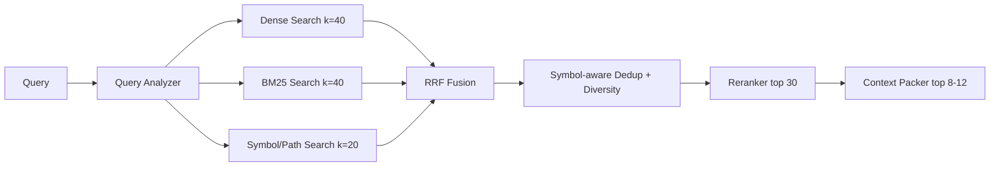

# Hybrid Retrieval 设计

## 1. 目标

代码查询既包含自然语言意图，也包含精确标识符、路径、错误文本和 API 名称。单一向量检索容易漏掉精确符号，单一 BM25 又难以理解“登录流程”与 `authenticate_user` 的语义关联，因此使用多路召回。

## 2. 查询处理

`QueryAnalyzer` 输出：

```json
{
  "intent": "locate_implementation",
  "semantic_query": "user authentication and token creation",
  "keywords": ["login", "authenticate", "token"],
  "symbols": ["AuthService.login"],
  "path_globs": ["**/auth/**"],
  "languages": [],
  "need_relations": true
}
```

第一版优先用规则提取反引号符号、路径、CamelCase/snake_case 标识符，再让小模型做可选的意图分类和查询扩展。模型输出必须经过 schema 校验，失败时回退到原始查询。

## 3. 召回链路



### Dense Search

使用代码/文本兼容的 Embedding。过滤条件至少包含 repository、active index version、language 和 path。模型名称、维度和归一化策略写入索引元数据。

### BM25

代码 tokenizer 需要保留完整标识符，同时拆分：

- `getUserById` → `get`, `user`, `by`, `id`, `getUserById`
- `get_user_by_id` → 同等子词；
- 路径段、符号名和签名给予更高 field boost；
- 不移除代码中常见但有意义的词，如 `get`、`set`、`impl`。

### Symbol/Path Search

对完全限定名、短符号名、文件路径做精确和前缀检索。它不依赖 LLM，是定位具体代码实体的可靠通道。

## 4. 融合与排序

初版使用 Reciprocal Rank Fusion：

```text
rrf_score(d) = Σ 1 / (k + rank_i(d)),  k=60
```

然后加入有限的业务特征：精确符号命中、路径命中、当前文件邻近度、解析质量。不要直接混加不同检索器的原始分数，因为量纲不可比。

Reranker 输入为 `query + chunk metadata + chunk text`，只重排融合后的前 30 条。不可用或超时则直接使用融合顺序，整个请求不失败。

## 5. 去重与上下文打包

- 相同符号的多个 part 可相邻合并；
- 相似内容或生成文件降权；
- 默认限制单文件占最终上下文的比例，避免一个大文件垄断；
- 关系分析查询可扩展一跳邻居，但扩展结果必须保留来源边；
- `ContextPacker` 按 Token 预算选取证据，不截断行号引用的完整性。

## 6. Evidence 契约

```json
{
  "evidence_id": "ev_01",
  "repository_id": "repo_01",
  "commit_sha": "abc123",
  "path": "src/auth/service.py",
  "symbol": "AuthService.login",
  "start_line": 42,
  "end_line": 78,
  "content": "...",
  "scores": {"rrf": 0.031, "rerank": 0.91},
  "reason": ["semantic_match", "symbol_match"]
}
```

答案只能引用本次 Run 中存在的 `evidence_id`。服务端校验引用，移除或重试修复无效引用。

## 7. Phase 2 实现记录

默认实现采用 `HashEmbeddingProvider` 和 `HeuristicCodeReranker` 作为完全离线、结果可复现的基线。`deploy/compose.local-models.yaml` 可将 Embedding 切换为 Ollama 上的 `qwen3-embedding:0.6b`：文档输入直接编码，查询输入增加面向代码检索的英文 instruction，响应必须满足数量、维度、有限值和非零范数校验。三路召回使用 `asyncio.gather` 并独立记录耗时；单路异常只标记降级。Reranker 在超时、异常或返回数量错误时回退到 RRF 顺序。

Qwen3 0.6B 默认输出 1024 维向量。本地模型覆盖使用独立 collection `codemind_code_chunks_qwen3_0_6b`，避免与默认 256 维 Hash 向量混用。切换模型或维度后必须重新创建索引版本，旧向量不能复用。

第一版本地模型方案仍保留启发式 Reranker。原因是 8 GiB 显存需要优先容纳 8B LLM，而模型 Reranker 会对每个候选执行额外推理。只有在冻结评测集证明排序收益显著高于延迟成本后，才启用 `Qwen3-Reranker-0.6B`。

BM25 索引使用 SQLite 文件按不可变 index version 持久化，并兼容 Phase 1 未存储 language 字段的旧索引。API 容器以只读卷访问 BM25，Worker 独占写入新版本；PostgreSQL 的活动版本保证三类索引始终绑定同一快照。
